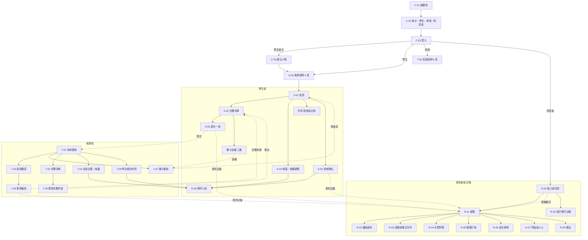
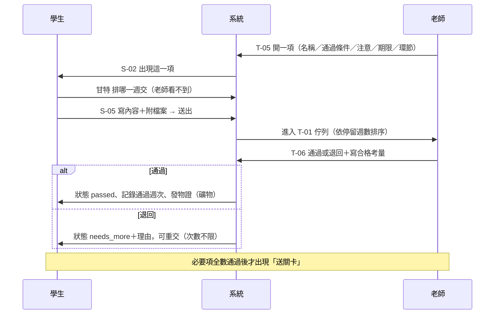
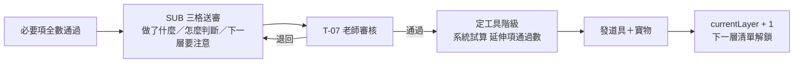
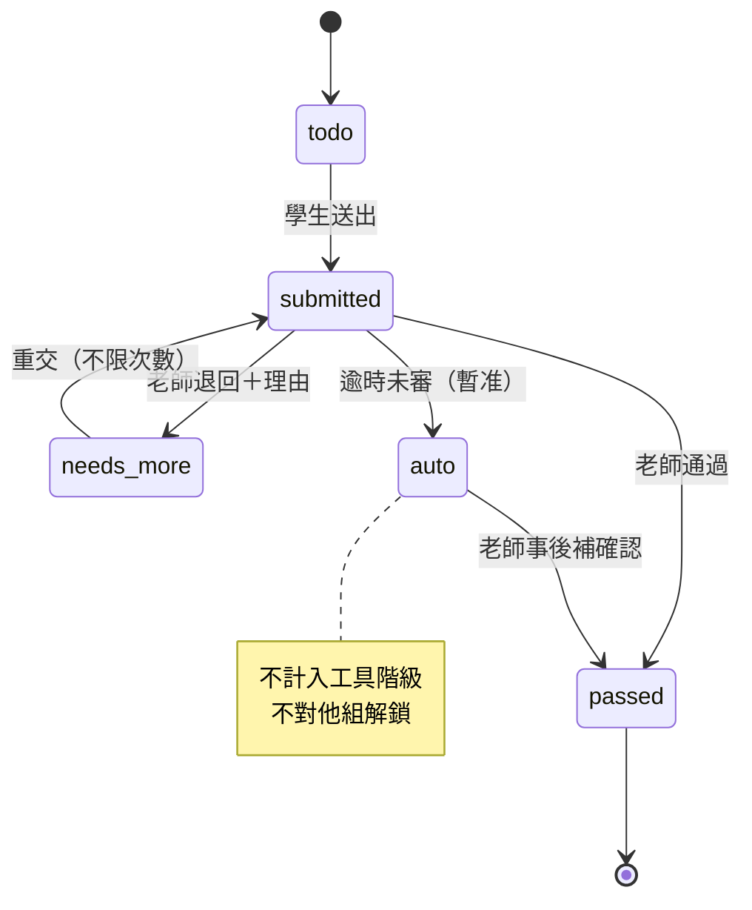
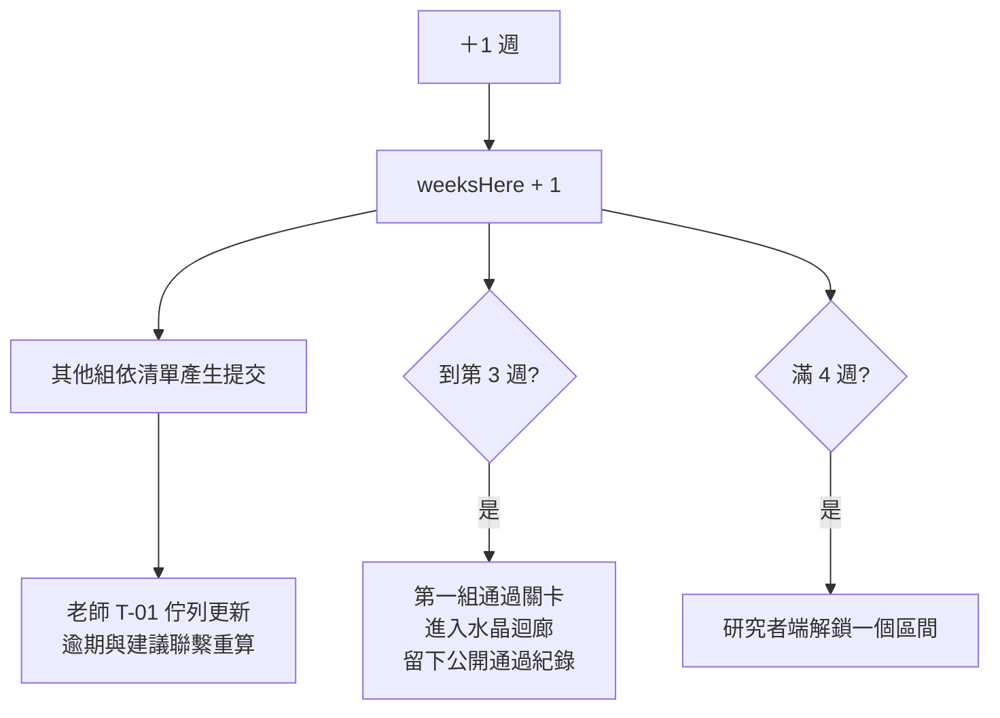
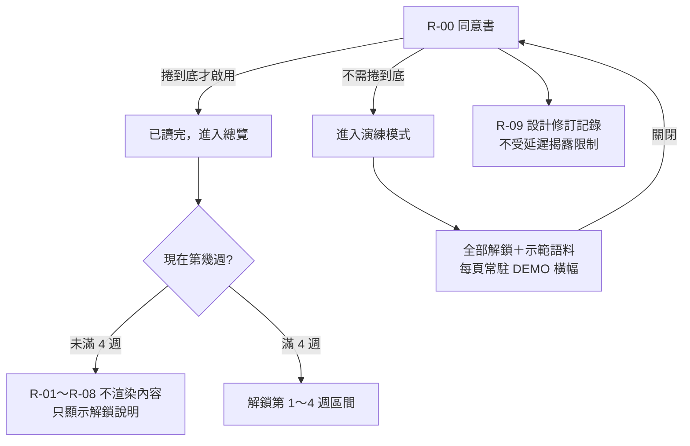
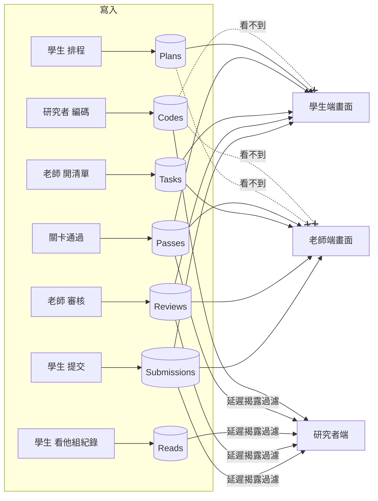
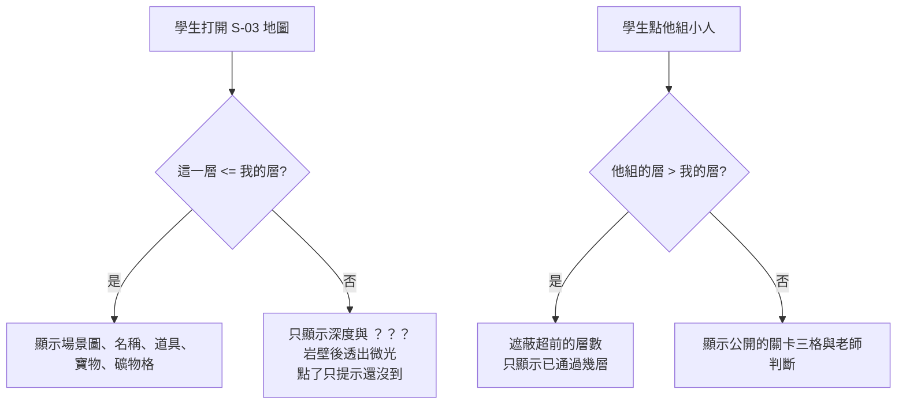

# 流程圖

以下圖表為 Mermaid 語法，可直接貼進支援 Mermaid 的編輯器（VS Code、GitHub、Notion）檢視。

## 1. 全系統地圖（三端）

## 2. 核心迴圈（學生一項任務的一生）

## 3. 關卡與換層

## 4. 任務狀態機

## 5. 每週推進與其他組

## 6. 研究者端的門檻

## 7. 資料流（誰寫、誰讀）

## 8. 迷霧規則（學生能看到什麼）

